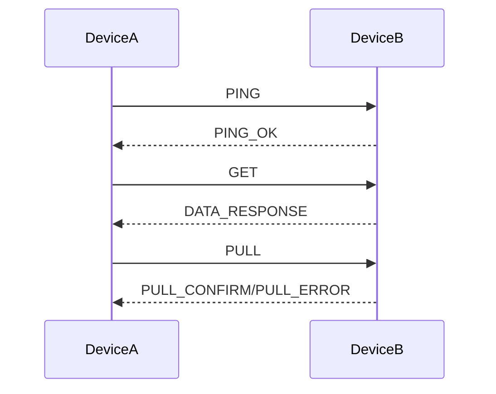

# EasyHTTP

> **A lightweight HTTP-based P2P framework for IoT and device-to-device communication**


## 🚀 Quick Start

### Installation

```bash
# Clone and install
git clone https://github.com/slpuk/easyhttp-python.git
cd easyhttp-python
pip install -e .

# Or directly from GitHub
pip install git+https://github.com/slpuk/easyhttp-python.git
```

### Basic Usage

```python
from easyhttp import EasyHTTP
import time

# Initialize a device
easy = EasyHTTP(debug=True, port=5000)
easy.start()

print(f"Device ID: {easy.id}")

# Manually add another device
easy.add_device("7H8G2K", "192.168.1.100", 5000)

# Ping to check if device is online
if easy.ping("7H8G2K"):
    print("Device is online!")
    
# Request data from device
response = easy.get("7H8G2K")
if response:
    print(f"📨 Received: {response.get('data')}")
```

## 📖 About

**EasyHTTP** is a simple yet powerful framework that enables P2P (peer-to-peer) communication between devices using plain HTTP.

### Key Features:
- **🔄 P2P Architecture** - No central server required
- **📡 Event-Driven Communication** - Callback-based architecture
- **🆔 Human-Readable Device IDs** - Base32 identifiers instead of IP addresses
- **🚀 Easy to Use** - Simple API with minimal setup

## 🏗️ Architecture

### Device Identification
Instead of using hard-to-remember IP addresses, each device in the EasyHTTP network has a unique 6-character identifier:

- **Format**: 6 characters from Base32 alphabet (without ambiguous characters)
- **Alphabet**: `23456789ABCDEFGHJKLMNPQRSTUVWXYZ`
- **Examples**: `7H8G2K`, `AB3F9Z`, `X4R7T2`
- **Generation**: Randomly generated on first boot, stored in device configuration

### Command System
EasyHTTP uses a simple JSON-based command system:

| Command | Description |
|---------|-------------|
| `PING` | Check if another device is reachable |
| `PING_OK` | Response to ping request |
| `GET` | Request data from a device |
| `DATA_RESPONSE` | Send data in response to GET |
| `PULL` | Request to write/execute on remote device |
| `PULL_CONFIRM` | Success confirmation for PULL command |
| `PULL_ERROR` | Error response for PULL command |

### Communication Flow


## 📦 Installation & Setup

### Python Installation
```bash
# Install directly from GitHub
pip install git+https://github.com/slpuk/easyhttp-python.git

# Or install from source
git clone https://github.com/Slpuk/easyhttp-python
cd easyhttp-python
pip install -e .
```

### Basic Example with Callbacks
```python
import time
from easyhttp import EasyHTTP

def handle_incoming_data(sender_id, data, timestamp):
    # Callback for incoming data
    print(f"From {sender_id}: {data}")

def handle_get_request(sender_id, timestamp):
    # Callback for GET requests - returns data when someone requests it
    return {
        "temperature": 23.5,
        "humidity": 45,
        "status": "normal",
        "timestamp": timestamp
    }

def handle_pull(sender_id, data, timestamp):
    print(f"Control from {sender_id}: {data}")
    if data.get("command") == "led":
        state = data.get("state")
        print(f"[CONTROL] Turning LED {state}")
        # Here you can add real GPIO control
        return True
    return False

# Create and start EasyHTTP
easy = EasyHTTP(debug=True, port=5000)
easy.on('on_data_response', handle_incoming_data)
easy.on('on_get', handle_get_request)
easy.on('on_pull', handle_get_request)
easy.start()

print(f"Device {easy.id} is running!")

# Add a known device
easy.add_device("ABC123", "192.168.1.100", 5000)

# Monitor device status
while True:
    if easy.ping("ABC123"):
        print("Device ABC123 is online")
    else:
        print("Device ABC123 is offline")
    time.sleep(5)
```

## 📚 Examples

Check the [`examples/`](examples/) directory for more:

- [`basic_ping.py`](examples/basic_ping.py) - Basic device communication
- [`two_devices.py`](examples/two_devices.py) - Two devices exchanging data
- [`sensor_simulator.py`](examples/sensor_simulator.py) - Simulated IoT sensor
- [`device_control.py`](examples/device_control.py) - 

## 🔧 API Reference

Check the [`docs/api.md`](docs/api.md) directory for functions documentation
