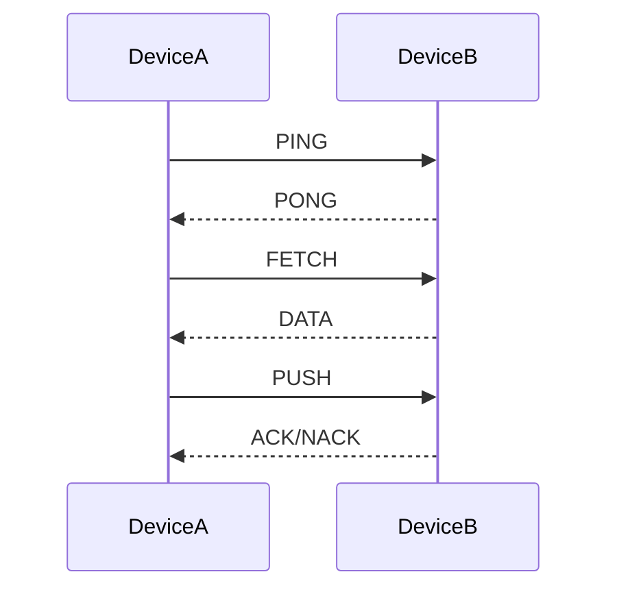

# EasyHTTP
[EN README](README.md) | [RU README](README_RU.md)
> **A lightweight HTTP-based P2P framework for IoT and device-to-device communication**


> [!WARNING]
> **Breaking Changes from 0.2.0**
> 
> ### API Changes
> | 0.2.0 | 0.3.1-beta | Notes |
> |--------|--------|-------|
> | `get()` | `fetch()` | Same functionality |
> | `pull()` | `push()` | Same functionality |
> | `'on_get'` | `'on_fetch'` | Callback name |
> | `'on_data_response'` | `'on_data'` | Callback name |
> | `'on_pull'` | `'on_push'` | Callback name |
> 
> ### Migration Example
> ```python
> # 0.2.0 (OLD):
> easy = EasyHTTP()
> easy.get("ABC123")
> easy.pull("ABC123", data)
> 
> # 0.3.1-beta (NEW):
> # Sync
> easy = EasyHTTP()
> easy.fetch("ABC123")
> easy.push("ABC123", data)
>
> # Async
> easy = EasyHTTPAsync()  # Async!
> await easy.fetch("ABC123")  # Await!
> await easy.push("ABC123", data)
> ```


## 🚀 Quick Start

### Installation
> [!NOTE]
> Both methods require **Git** to be installed.<br>
> PyPI upload is **preparing**

```bash
# Clone and install
git clone https://github.com/slpuk/easyhttp-python.git
cd easyhttp-python
pip install -e .

# Or directly from GitHub
pip install git+https://github.com/slpuk/easyhttp-python.git
```

### Basic Usage (synchronous)

```python
from easyhttp import EasyHTTP

def main():
    # Initialize a device
    easy = EasyHTTP(debug=True, port=5000)
    easy.start()
    
    print(f"Device ID: {easy.id}")
    
    # Manually add another device
    easy.add("ABC123", "192.168.1.100", 5000)
    
    # Ping to check if device is online
    if easy.ping("ABC123"):
        print("Device is online!")
    
    # Request data from device
    response = easy.fetch("ABC123")
    if response:
        print(f"Received: {response.get('data')}")
    
    # Push data to device
    success = easy.push("ABC123", {"led": "on"})
    if success:
        print("Command executed successfully")

# Starting main process
if __name__ == "__main__":
    main()
```

### Or asynchronous

```python
import asyncio
from easyhttp import EasyHTTPAsync

async def main():
    # Initialize a device
    easy = EasyHTTPAsync(debug=True, port=5000)
    await easy.start()
    
    print(f"Device ID: {easy.id}")
    
    # Manually add another device
    easy.add("ABC123", "192.168.1.100", 5000)
    
    # Ping to check if device is online
    if await easy.ping("ABC123"):
        print("Device is online!")
    
    # Request data from device
    response = await easy.fetch("ABC123")
    if response:
        print(f"Received: {response.get('data')}")
    
    # Push data to device
    success = await easy.push("ABC123", {"led": "on"})
    if success:
        print("Command executed successfully")

# Starting main process
if __name__ == "__main__":
    asyncio.run(main())
```
---

> [!IMPORTANT]
> **Version in beta state.** Features will be added incrementally.
> 
> ## 🗺️ 0.3.x Roadmap
> - [x] **0.3.0-alpha** — Async core (FastAPI + aiohttp)
> - [x] **0.3.1-beta** — Sync wrapper (`EasyHTTP` class)
> - [ ] **0.3.2** — Context managers

## 📖 About

**EasyHTTP** is a simple yet powerful framework with asynchronous core that enables P2P (peer-to-peer) communication between devices using plain HTTP.

### Key Features:
- **🔄 P2P Architecture** - No central server required
- **📡 Event-Driven Communication** - Callback-based architecture
- **🆔 Human-Readable Device IDs** - Base32 identifiers instead of IP addresses
- **✅ Easy to Use** - Simple API with minimal setup
- **🚀 Performance** - Asynchronous code and lightweight libraries(FastAPI/aiohttp)

## Project Structure
```
easyhttp-python/
├── docs/
│   ├── EasyHTTP.md      # Sync API reference
│   └── EasyHTTPAsync.md # Async API reference
├── easyhttp/
│   ├── __init__.py
│   ├── core.py     # Main framework file/core
│   └── wrapper.py  # Synchronous wrapper
├── examples/
│   ├── async/       # Asynchronous examples
│   │   ├── basic_ping.py
│   │   ├── callback_preview.py
│   │   ├── device_control.py
│   │   ├── sensor_simulator.py
│   │   └── two_devices.py
│   └── sync/      # Synchronous examples
│       ├── basic_ping.py
│       ├── callback_preview.py
│       ├── device_control.py
│       ├── sensor_simulator.py
│       └── two_devices.py
├── .gitignore
├── LICENSE             # MIT license
├── pyproject.toml      # Project config
├── README_RU.md        # Russian documentation
├── README.md           # This file
└── requirements.txt    # Project dependencies
```

## 🏗️ Architecture

### Device Identification
Instead of using hard-to-remember IP addresses, each device in the EasyHTTP network has a unique 6-character identifier:

- **Format**: 6 characters from Base32 alphabet (without ambiguous characters)
- **Alphabet**: `23456789ABCDEFGHJKLMNPQRSTUVWXYZ`
- **Examples**: `7H8G2K`, `AB3F9Z`, `X4R7T2`
- **Generation**: Randomly generated on first boot, stored in device configuration

### Command System
EasyHTTP uses a simple JSON-based command system:

| Command | Value | Description |
|---------|-------|-------------|
| `PING` | 1 | Check if another device is reachable |
| `PONG` | 2 | Response to ping request |
| `FETCH` | 3 | Request data from a device |
| `DATA` | 4 | Send data or anwser to FETCH |
| `PUSH` | 5 | Request to write/execute on remote device |
| `ACK` | 6 | Success/confirmation |
| `NACK` | 7 | Error/reject |

### Communication Flow


## 📦 Installation & Setup

### Python Installation
> [!NOTE]
> Both methods require **Git** to be installed.<br>
> PyPI upload is **preparing**

```bash
# Install directly from GitHub
pip install git+https://github.com/slpuk/easyhttp-python.git

# Or install from source
git clone https://github.com/Slpuk/easyhttp-python
cd easyhttp-python
pip install -e .
```

### Basic Example with Callbacks(Synchronous)
```python
import time
from easyhttp import EasyHTTP

# Callback function
def handle_data(sender_id, data, timestamp):
    # Callback for incoming DATA responses
    print(f"From {sender_id}: {data}")

def handle_fetch(sender_id, query, timestamp):
    # Callback for FETCH requests - returns data when someone requests it
    print(f"FETCH request from {sender_id}")
    return {
        "temperature": 23.5,
        "humidity": 45,
        "status": "normal",
        "timestamp": timestamp
    }

def handle_push(sender_id, data, timestamp):
    # Callback for PUSH requests - handle control commands
    print(f"Control from {sender_id}: {data}")
    if data and data.get("command") == "led":
        state = data.get("state", "off")
        print(f"[CONTROL] Turning LED {state}")
        # Here you can add real GPIO control
        return True  # Successful → ACK
    return False  # Error → NACK

def main():
    # Initializing EasyHTTP - sync wrapper of EasyHTTPAsync
    easy = EasyHTTP(debug=True, port=5000)
    
    # Setting up callback functions
    easy.on('on_ping', handle_ping)
    easy.on('on_pong', handle_pong)
    easy.on('on_fetch', handle_fetch)
    easy.on('on_data', handle_data)
    easy.on('on_push', handle_push)
    
    easy.start()  # Starting server
    print(f"Device {easy.id} is running on port 5000!")
    
    # Adding device
    easy.add("ABC123", "192.168.1.100", 5000)
    print("Added device ABC123")
    
    # Monitoring device's status
    try:
        while True:
            if easy.ping("ABC123"):
                print("Device ABC123 is online")
            else:
                print("Device ABC123 is offline")
            
            time.sleep(5)
    
    except KeyboardInterrupt:
        print("\nStopping device...")
        easy.stop()  # Stopping server

# Starting main process
if __name__ == "__main__":
    main()
```

## 📚 Examples

Check the [`examples/`](examples/) directory for more:
<br> (this synchronous examples, check the [`examples/async/`](examples/async/) for asynchronous)

- [`basic_ping.py`](examples/sync/basic_ping.py) - Basic device communication
- [`callback_preview.py`](examples/sync/callback_preview.py) - Callback events demo
- [`two_devices.py`](examples/sync/two_devices.py) - Two devices exchanging data
- [`sensor_simulator.py`](examples/sync/sensor_simulator.py) - Simulated IoT sensor
- [`device_control.py`](examples/sync/device_control.py) - Remote device control

## 🔧 API Reference

Check the directories for functions documentation:
- Synchronous wrapper: [`docs/EasyHTTP.md`](docs/EasyHTTP.md)
- Asynchronous core: [`docs/EasyHTTPAsync.md`](docs/EasyHTTPAsync.md)
