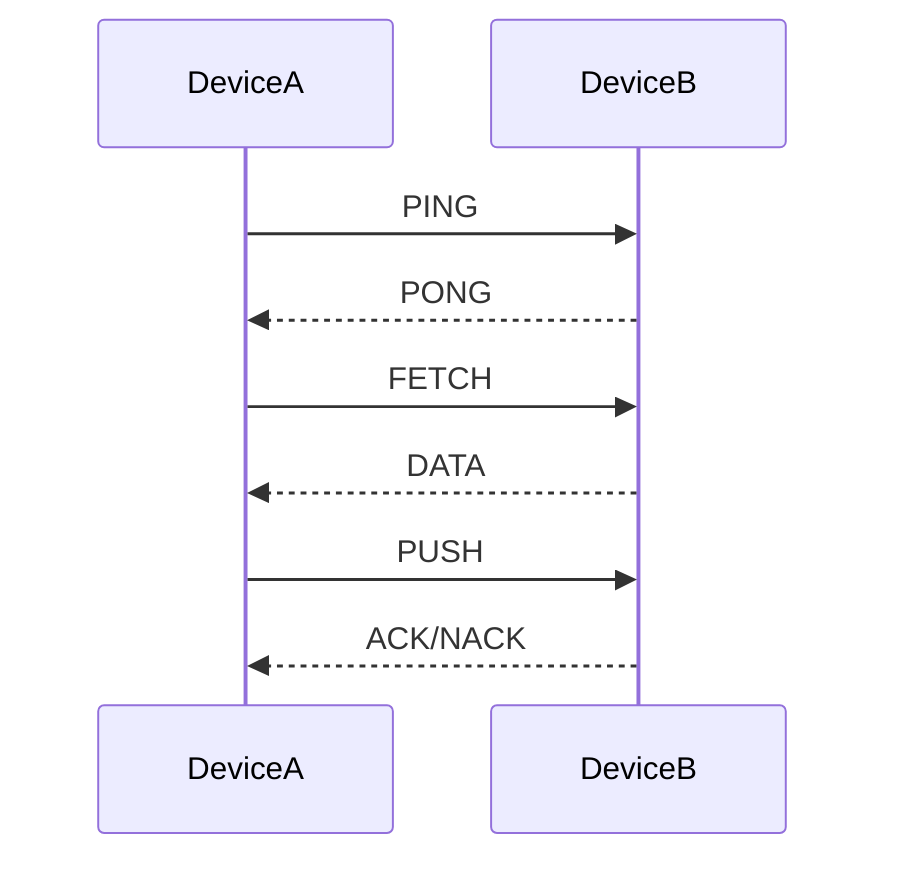

# EasyHTTP
[EN README](README.md) | [RU README](README_RU.md)
> **Легковесный фреймворк на базе HTTP для P2P-связи в IoT**


> [!WARNING]
> **Важные изменения с 0.2.0**
> 
> ### Изменения в API
> | 0.2.0 | 0.3.1-beta | Notes |
> |--------|--------|-------|
> | `get()` | `fetch()` | Тот же функционал |
> | `pull()` | `push()` | Тот же функционал |
> | `'on_get'` | `'on_fetch'` | Переименование коллбэка |
> | `'on_data_response'` | `'on_data'` | Переименование коллбэка |
> | `'on_pull'` | `'on_push'` | Переименование коллбэка |
> 
> ### Пример миграции
> ```python
> # 0.2.0 (СТАРЫЙ):
> easy = EasyHTTP()
> easy.get("ABC123")
> easy.pull("ABC123", data)
> 
> # 0.3.1-beta (НОВЫЙ):
> # Синхр.
> easy = EasyHTTP()
> easy.fetch("ABC123")
> easy.push("ABC123", data)
>
> # Асинхр.
> easy = EasyHTTPAsync()  # Async!
> await easy.fetch("ABC123")  # Await!
> await easy.push("ABC123", data)
> ```


## 🚀 Быстрый Старт

### Installation
> [!NOTE]
> Оба способа требуют установленный **Git**.<br>
> **Идёт подготовка** к публикации на PyPI.

```bash
# Скопируйте и установите
git clone https://github.com/slpuk/easyhttp-python.git
cd easyhttp-python
pip install -e .

# Либо напрямую с GitHub
pip install git+https://github.com/slpuk/easyhttp-python.git
```

### Базовое Использование (Cинхронный)

```python
from easyhttp import EasyHTTP

def main():
    # Инициализируем библиотеку
    easy = EasyHTTP(debug=True, port=5000)
    easy.start()
    
    print(f"Мой ID: {easy.id}")
    
    # Вручную добавляем удаленное устройство
    easy.add("ABC123", "192.168.1.100", 5000)
    
    # Пингуем для проверки состояния устройства
    if easy.ping("ABC123"):
        print("Устройство в сети!")
    
    # Запрашиваем данные с другого устройства
    response = easy.fetch("ABC123")
    if response:
        print(f"Получено: {response.get('data')}")
    
    # Записываем данные
    success = easy.push("ABC123", {"led": "on"})
    if success:
        print("Команда выполнена успешно")

# Запускаем основную функцию
if __name__ == "__main__":
    main()
```

#### ...либо aсинхронный

```python
import asyncio
from easyhttp import EasyHTTPAsync

async def main():
    # Инициализируем библиотеку
    easy = EasyHTTPAsync(debug=True, port=5000)
    await easy.start()
    
    print(f"Мой ID: {easy.id}")
    
    # Вручную добавляем удаленное устройство
    easy.add("ABC123", "192.168.1.100", 5000)
    
    # Пингуем для проверки состояния устройства
    if await easy.ping("ABC123"):
        print("Устройство в сети!")
    
    # Запрашиваем данные с другого устройства
    response = await easy.fetch("ABC123")
    if response:
        print(f"Получено: {response.get('data')}")
    
    # Записываем данные
    success = await easy.push("ABC123", {"led": "on"})
    if success:
        print("Команда выполнена успешно")

# Запускаем основную функцию
if __name__ == "__main__":
    asyncio.run(main())
```
---

> [!IMPORTANT]
> **Версия на бета этапе.** Функции постепенно будут добавляться.
> 
> ## 🗺️ Планы на 0.3.x
> - [x] **0.3.0-alpha** — Асинхронное ядро (FastAPI + aiohttp)
> - [x] **0.3.1-beta** — Синхронная надстройка (класс `EasyHTTP`)
> - [ ] **0.3.2** — Контекстные менеджеры

## 📖 О проекте

**EasyHTTP** — это простой, но мощный фреймворк с асинхронным ядром, обеспечивающий P2P-связь между устройствами с использованием обычного HTTP.

### Key Features:
- **🔄 P2P Архитектура** - Центральный сервер не требуется
- **📡 Событийно-ориентированная архитектура** - Основана на коллбэках
- **🆔 Человеко-читаемые ID** - Base32 вместо IP-адресов
- **✅ Простота в использовании** - Минимальная настройка API
- **🚀 Производительность** - Асинхронный код и лёгкие библиотеки (FastAPI/aiohttp)

## Структура Проекта
```
easyhttp-python/
├── docs/
│   ├── EasyHTTP.md      # Документация синхронного API
│   └── EasyHTTPAsync.md # Документация асинхронного API
├── easyhttp/
│   ├── __init__.py
│   ├── core.py     # Основной код фреймворка
│   └── wrapper.py  # Синхронная оболочка
├── examples/
│   ├── async/       # Примеры с асинхронным кодом
│   │   ├── basic_ping.py
│   │   ├── callback_preview.py
│   │   ├── device_control.py
│   │   ├── sensor_simulator.py
│   │   └── two_devices.py
│   └── sync/      # Примеры с синхронным кодом
│       ├── basic_ping.py
│       ├── callback_preview.py
│       ├── device_control.py
│       ├── sensor_simulator.py
│       └── two_devices.py
├── .gitignore
├── LICENSE             # Лицензия MIT
├── pyproject.toml      # Конфиг проекта
├── README_RU.md        # Этот файл
├── README.md           # Английская документация
└── requirements.txt    # Зависимости проекта
```

## 🏗️ Архитектура

### Идентификация Устройств
Вместо использования труднозапоминаемых IP-адресов каждое устройство в сети EasyHTTP имеет уникальный 6-символьный идентификатор:

- **Формат**: 6-ти символьный из алфавита Base32 (без неоднозначных символов)
- **Алфавит**: `23456789ABCDEFGHJKLMNPQRSTUVWXYZ`
- **Примеры**: `7H8G2K`, `AB3F9Z`, `X4R7T2`
- **Генерация**: Генерируется случайным образом при первой загрузке и сохраняется в конфигурации устройства

### Система Команд
EasyHTTP использует простую систему команд на основе JSON:

| Команда | Значение | Описание |
|---------|-------|-------------|
| `PING` | 1 | Проверка, доступно ли другое устройство. |
| `PONG` | 2 | Ответ на ping запрос |
| `FETCH` | 3 | Запрос данных с другого устройства |
| `DATA` | 4 | Отправка данных, либо ответ на FETCH |
| `PUSH` | 5 | Запрос на запись/выполнение на удалённом устройстве |
| `ACK` | 6 | Успех/подтверждение |
| `NACK` | 7 | Ошибка/отклонение |

### Схема Коммуникации


## 📦 Установка и Настройка

### Установка
> [!NOTE]
> Оба способа требуют установленный **Git**.<br>
> **Идёт подготовка** к публикации на PyPI.

```bash
# Напрямую с GitHub
pip install git+https://github.com/slpuk/easyhttp-python.git

# Либой скопируйте и установите
git clone https://github.com/Slpuk/easyhttp-python
cd easyhttp-python
pip install -e .
```

### Простой пример с коллбэками
```python
import time
from easyhttp import EasyHTTPAsync

# Коллбэк функция
def handle_data(sender_id, data, timestamp):
    # Коллбэк для входящих DATA команд
    print(f"From {sender_id}: {data}")

def handle_fetch(sender_id, query, timestamp):
    # Коллбэк функция для запросов FETCH — возвращает данные, когда кто-то их запрашивает
    print(f"FETCH request from {sender_id}")
    return {
        "temperature": 23.5,
        "humidity": 45,
        "status": "normal",
        "timestamp": timestamp
    }

def handle_push(sender_id, data, timestamp):
    # Коллбэк для PUSH запросов - обработка команд управления
    print(f"Control from {sender_id}: {data}")
    if data and data.get("command") == "led":
        state = data.get("state", "off")
        print(f"[CONTROL] Turning LED {state}")
        # Здесь можно добавить реальное управление через GPIO.
        return True  # Успешно → ACK
    return False  # Ошибка → NACK

def main():
    # Инициализируем EasyHTTP
    easy = EasyHTTP(debug=True, port=5000)
    
    # Устанавливаем коллбэк функции
    easy.on('on_fetch', handle_fetch)
    easy.on('on_data', handle_data)
    easy.on('on_push', handle_push)
    
    easy.start()  # Запускаем сервер
    print(f"Устройство {easy.id} запущено на порту 5000!")
    
    # Вручную добавляем устройство
    easy.add("ABC123", "192.168.1.100", 5000)
    print("Устройство ABC123 добавлено")
    
    # Мониторим статус устройства
    try:
        while True:
            if easy.ping("ABC123"):
                print("Устройство ABC123 в сети")
            else:
                print("Устройство ABC123 оффлайн")
            
            time.sleep(5)
    
    except KeyboardInterrupt:
        print("\nОстановка...")
        easy.stop()  # ПРАВИЛЬНО останавливаем сервер

# Запускаем главную функцию
if __name__ == "__main__":
    main()
```

## 📚 Примеры

Проверьте [`examples/`](examples/) для дополнительных примеров:
<br> (ниже синхронные примеры, проверьте [`examples/async/`](examples/async/) для асинхронных)

- [`basic_ping.py`](examples/sync/basic_ping.py) - Базовая коммуникация между устройствами
- [`callback_preview.py`](examples/sync/callback_preview.py) - Демонстрация работы коллбэков
- [`two_devices.py`](examples/sync/two_devices.py) - Обмен данными между двумя устройствами
- [`sensor_simulator.py`](examples/sync/sensor_simulator.py) - Имитация IoT-датчика
- [`device_control.py`](examples/sync/device_control.py) - Управление удалённым устройством

## 🔧 Документация API

Дериктории с документацией:
- Синхронная оболочка: [`docs/EasyHTTP.md`](docs/EasyHTTP.md)
- Асинхронное ядро: [`docs/EasyHTTPAsync.md`](docs/EasyHTTPAsync.md)
