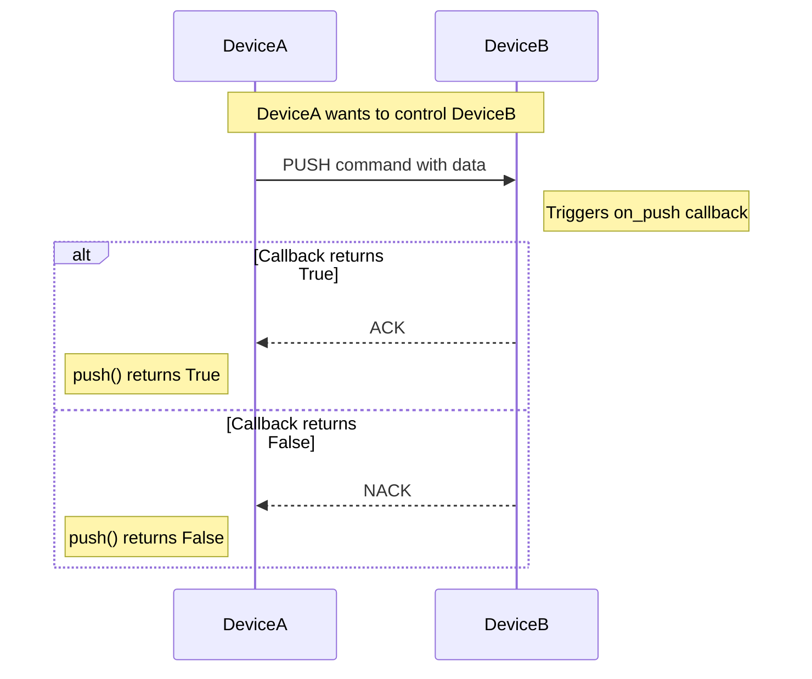

## 🔧 Synchronous API Reference

> Core Methods for **0.3.2**

## `EasyHTTP(debug=False, port=5000, config_file=None)`
Initialize a new EasyHTTP device.

**Parameters:**
- `debug` (bool): Enable debug output (default: False)
- `port` (int): HTTP server port (default: 5000)
- `config_file` (str, optional): Custom config file path. If `None`, uses `easyhttp_device.json` in current directory (default: None)

## `start()`
Start the HTTP server and generate device ID if not already set.

## `stop()`
Gracefully stop the HTTP server and cancel the server task.

## `add(device_id, ip, port)`
Manually add a device to the device cache.

**Parameters:**
- `device_id` (str): 6-character device ID
- `ip` (str): IP address of the device
- `port` (int): Port number of the device's HTTP server

**Example:**
```python
easy.add("ABC123", "192.168.1.100", 5000)
```

## `send(device_id, command_type, data=None)`
Manually sends command and data if available.

**Parameters:**
- `device_id` (str): 6-character device ID
- `command_type` (EasyHTTPAsync.commands.value): Command to send
- `data` (optional): Data to send (default: None)

**Returns:** Response dictionary (parsed JSON) if successful, `None` if failed.

**Example:**
```python
# Send a PING command
response = easy.send("ABC123", easy.commands.PING.value)
if response and response.get('type') == easy.commands.PONG.value:
    print("PING successful!")

# Send custom data with FETCH command
response = easy.send("ABC123", easy.commands.FETCH.value, {"data": "temperature"})
if response:
    print(f"Received: {response}")
```

### Available Commands

| Command | Value | Description |
|---------|-------|-------------|
| `PING` | 1 | Check if another device is reachable |
| `PONG` | 2 | Response to ping request |
| `FETCH` | 3 | Request data from a device |
| `DATA` | 4 | Send data or answer to FETCH |
| `PUSH` | 5 | Request to write/execute on remote device |
| `ACK` | 6 | Success/confirmation |
| `NACK` | 7 | Error/abort |

### `ping(device_id)`
Check if a device is online.

**Parameters:**
- `device_id` (str): ID of the device to ping

**Returns:** `True` if device responds, `False` otherwise.

**Example:**
```python
if easy.ping("ABC123"):
    print("Device is online!")
```

## `fetch(device_id, query=None)`
Request data from a device.

**Parameters:**
- `device_id` (str): ID of the device to query
- `query` (dict, optional): Additional query parameters

**Returns:** Response dictionary or `None` if failed.

**Example:**
```python
response = easy.fetch("ABC123", {"sensor": "temperature"})
if response and 'data' in response:
    print(f"Temperature: {response['data']['temperature']}°C")
```

## `push(device_id, data=None)`
Send data to another device for writing or remote execution.

**Parameters:**
- `device_id` (str): ID of the device to query
- `data` (dict/list/str/int/float/bool, optional): Data to send. Must be JSON-serializable (default: None)

**Returns:** `True` if device confirmed successful write (ACK), `False` if device responded with error or no response.

**Raises:** `TypeError`: If data is not JSON-serializable

**Example:**
```python
# Send configuration to device
success = easy.push("ABC123", {"led": "on", "brightness": 80})
if success:
    print("Successfully updated device configuration!")
else:
    print("Failed to update device configuration.")

# Send a command for execution
success = easy.push("ABC123", {"command": "reboot", "delay": 5})
```

### PUSH Command Workflow



## `on(event, callback)`
Register a callback function for an event.

**Available events:**
- `on_ping`: Triggered when PING is received from another device (Automatically sends PONG)
- `on_pong`: Triggered when PONG is received from another device
- `on_fetch`: Triggered when FETCH request is received from another device
- `on_data`: Triggered when DATA is received from another device
- `on_push`: Triggered when PUSH request is received. Callback should return `True` for success (sends ACK) or `False` for error (sends NACK).

**Example:**
```python
# Only synchronous callback funtions
def handle_fetch(sender_id, query, timestamp):
    return {"temperature": 24.5, "status": "normal"}

def handle_push(sender_id, data, timestamp):
    print(f"Received control command: {data}")
    # Process the command...
    if data.get("command") == "reboot":
        schedule_reboot()
        return True  # Send ACK
    return False  # Send NACK

def handle_data(sender_id, data, timestamp):
    print(f"Data from {sender_id}: {data}")

def handle_ping(sender_id):
    print(f"PING from device {sender_id}")

def handle_pong(sender_id):
    print(f"PONG from device {sender_id}")

easy.on('on_fetch', handle_fetch)
easy.on('on_push', handle_push)
easy.on('on_data', handle_data)
easy.on('on_ping', handle_ping)
easy.on('on_pong', handle_pong)
```

## Error Handling Examples

```python
# Example 1: Invalid data type
try:
    easy.push("ABC123", set([1, 2, 3]))  # set is not JSON-serializable
except TypeError as e:
    print(f"Data error: {e}")

# Example 2: Device not responding
if not easy.push("ABC123", {"command": "test"}):
    print("Device offline or rejected command")

# Example 3: Callback not registered on target
# If target device has no on_push callback, it will return NACK
```

## Context Managers
Framework supports context managers & full syntax, automatically starting/stopping the server.

```python
from easyhttp import EasyHTTP

with EasyHTTP(debug=True, port=5000) as easy:
    easy.add("ABC123", "192.168.1.100", 5000)
    if easy.ping("ABC123"):
        print("Device is online!")
```