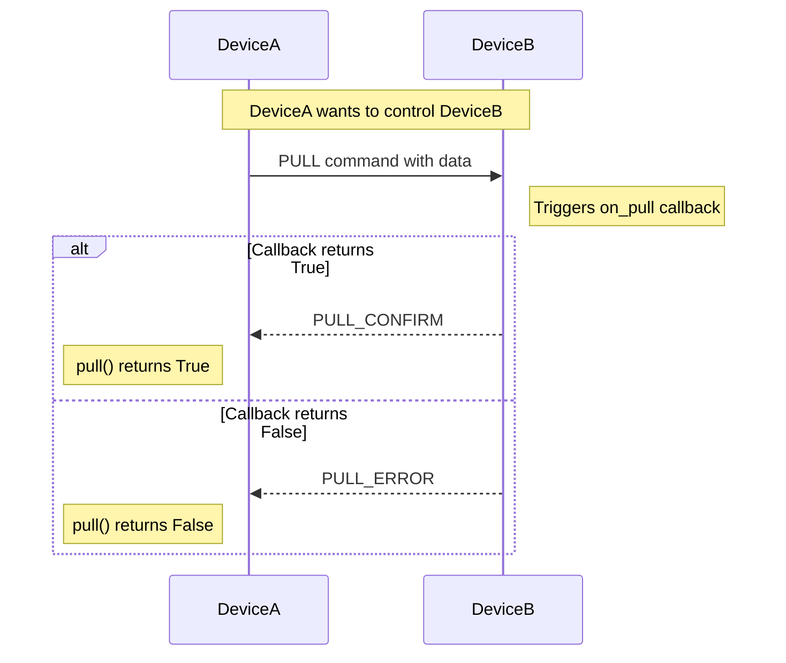

## 🔧 API Reference

> Core Methods

## `EasyHTTP(debug=False, port=5000, config_file=None)`
Initialize a new EasyHTTP device.

**Parameters:**
- `debug` (bool): Enable debug output (default: False)
- `port` (int): HTTP server port (default: 5000)
- `config_file` (str, optional): Custom config file path. If `None`, uses `easyhttp_device.json` in current directory (default: None)

## `start()`
Start the HTTP server and generate device ID if not already set.

## `add_device(device_id, ip, port)`
Manually add a device to the device cache.

**Parameters:**
- `device_id` (str): 6-character device ID
- `ip` (str): IP address of the device
- `port` (int): Port number of the device's HTTP server

**Example:**
```python
device.add_device("7H8G2K", "192.168.1.100", 5000)
device.add_device("ABC123", "localhost", 5001)
```

## `send(device_id, command_type, data=None)`
Manually sends command and data if available.

**Parameters:**
- `device_id` (str): 6-character device ID
- `command_type` (EasyHTTP.commands): Command to send
- `data` (optional): Data to send (default: None)

**Returns:** Response dictionary (parsed JSON) if successful, `None` if failed.

**Example:**
```python
# Send a PING command
response = device.send("7H8G2K", EasyHTTP.commands.PING)
if response and response.get('type') == EasyHTTP.commands.PING_OK.value:
    print("PING successful!")

# Send custom data with GET command
response = device.send("7H8G2K", EasyHTTP.commands.GET, {"query": "temperature"})
if response:
    print(f"Received: {response}")
```

### Available Commands

| Command | Value | Description |
|---------|-------|-------------|
| `PING` | 3 | Check device availability |
| `PING_OK` | 4 | Response to ping |
| `GET` | 5 | Request data from device |
| `DATA_RESPONSE` | 6 | Send data in response to GET |
| `PULL` | 7 | Request to write/execute on remote device |
| `PULL_CONFIRM` | 8 | Success confirmation for PULL command |
| `PULL_ERROR` | 9 | Error response for PULL command |

### `ping(device_id)`
Check if a device is online.

**Parameters:**
- `device_id` (str): ID of the device to ping

**Returns:** `True` if device responds, `False` otherwise.

**Example:**
```python
if easy.ping("7H8G2K"):
    print("Device is online!")
```

## `get(device_id, query=None)`
Request data from a device.

**Parameters:**
- `device_id` (str): ID of the device to query
- `query` (dict, optional): Additional query parameters

**Returns:** Response dictionary or `None` if failed.

**Example:**
```python
response = easy.get("7H8G2K", {"sensor": "temperature"})
if response and 'data' in response:
    print(f"Temperature: {response['data']['temperature']}°C")
```

## `pull(device_id, data=None)`
Send data to another device for writing or remote execution.

**Parameters:**
- `device_id` (str): ID of the device to query
- `data` (dict/list/str/int/float/bool, optional): Data to send. Must be JSON-serializable (default: None)

**Returns:** `True` if device confirmed successful write (PULL_CONFIRM), `False` if device responded with error or no response.

**Raises:** `TypeError`: If data is not JSON-serializable

**Example:**
```python
# Send configuration to device
success = easy.pull("7H8G2K", {"led": "on", "brightness": 80})
if success:
    print("Successfully updated device configuration!")
else:
    print("Failed to update device configuration.")

# Send a command for execution
success = easy.pull("SENSOR1", {"command": "reboot", "delay": 5})
```

### PULL Command Workflow



## `on(event, callback)`
Register a callback function for an event.

**Available events:**
- `on_get`: Triggered when a GET request is received from another device
- `on_data_response`: Triggered when data is received from another device
- `on_ping`: Triggered when PING is received from another device (Automatically sends PING_OK)
- `on_pull`: Triggered when PULL request is received. Callback should return `True` for success (sends PULL_CONFIRM) or `False` for error (sends PULL_ERROR).

**Example:**
```python
def handle_get(sender_id, timestamp):
    return {"temperature": 24.5, "status": "normal"}

def handle_pull(sender_id, data, timestamp):
    print(f"Received control command: {data}")
    # Process the command...
    if data.get("command") == "reboot":
        schedule_reboot()
        return True  # Send PULL_CONFIRM
    return False  # Send PULL_ERROR

def handle_data(sender_id, data, timestamp):
    print(f"Data from {sender_id}: {data}")

easy.on('on_get', handle_get)
easy.on('on_pull', handle_pull)
easy.on('on_data_response', handle_data)
```

## Error Handling Examples

```python
# Example 1: Invalid data type
try:
    easy.pull("7H8G2K", set([1, 2, 3]))  # set is not JSON-serializable
except TypeError as e:
    print(f"Data error: {e}")

# Example 2: Device not responding
if not easy.pull("OFFLINE1", {"command": "test"}):
    print("Device offline or rejected command")

# Example 3: Callback not registered on target
# If target device has no on_pull callback, it will return PULL_ERROR
```